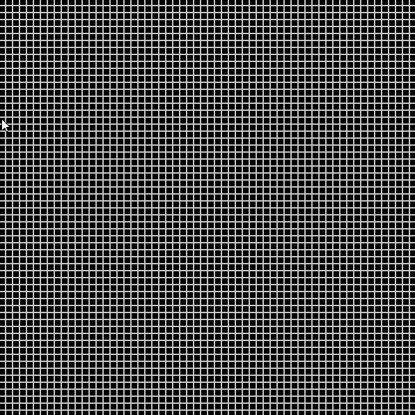

# PathFinder
Vanilla python implementation of the A* pathfinding algorithm. Hope to eventually improve the algorithm using priority queues or min-heaps. Default search heuristics include manhattan distance and euclidean distance. Visualization of the search process and final path was done using PyGame. 

